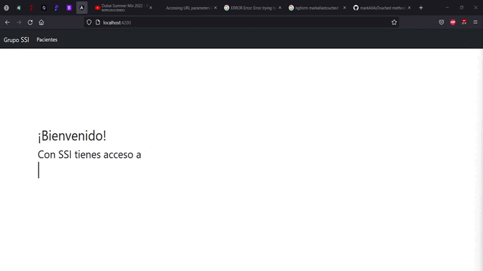
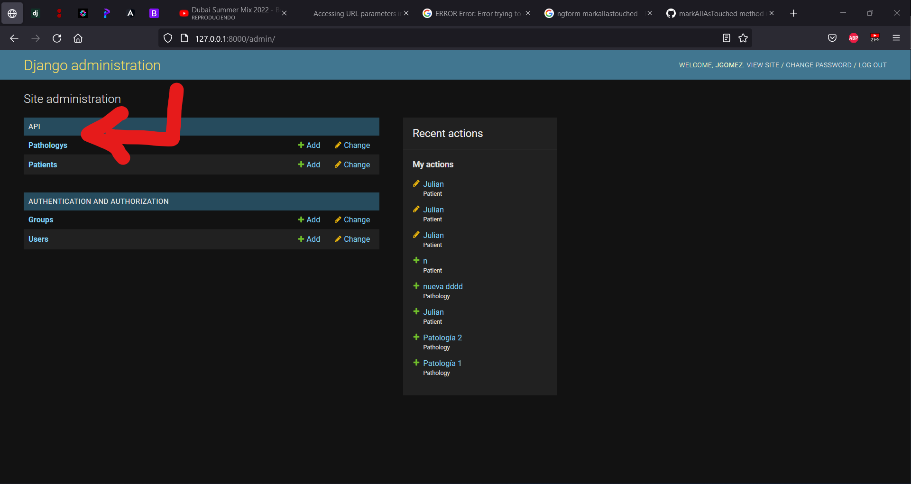

# Prueba Tecnica Grupo SSI
### Julian Andres Gomez Gomez 
[](https://travis-ci.org/joemccann/dillinger)

<div align="center">

</div>


## Requerimientos:
- Python 3.8+
- Node 13+ 
- Angular CLI 12+
- Mongo DB [Locally](https://www.mongodb.com/try/download/community?tck=docs_server) 

## Instalación
### Backend
1. Clone el repositorio 
```sh
git clone https://github.com/DevJaGz/prueba-tecnica-ssi.git
```
2. Diríjase a la carpeta de backend
```sh
cd .\prueba-tecnica-ssi\backend
```
3. Cree un ambiente virtual para python 
```sh
python -m venv _env
```
4. Instale los paquetes dentro del ambiente virtual
```sh
.\_env\Scripts\activate
pip install -r requirements.txt
```
5. Cree las migraciones de los modelos
```sh
python .\manage.py makemigrations
```
6. Migre las migraciones a la base de datos Local de Mongo
```sh
python .\manage.py migrate
```
7. Cree un usuario (Siga las instrucciones por consola. Recuerde muy bien el usuario y la contraseña ingresados)
```sh
python .\manage.py createsuperuser
```
8. Levante el Backend
```sh
python .\manage.py runserver 127.0.0.1:8000
```

### Frontend 
1. Diríjase a la carpeta del frontend (Partiendo desde el directorio del backend)
```sh
cd ..\frontend
```
2. Instale las dependecias (Requiere Node)
```sh
npm install
```
3. Instale las dependecias (Requiere Node)
```sh
npm install
```
4. Levante el Frontend
```sh
ng s --host 127.0.0.1 --port 4200
```
## Uso
1. Diríjase al navegador y escriba `http://127.0.0.1:8000/admin/`
> Se abríra el panel de administrador de django. Ingrese el usuario y la contraseña que registro al crear el usuario. En la parte superior izquierda encontrará el modelo de patologías (Pathologys), como se observa a continuación.

<div align="center">

</div>

> Ingrese al modelo de patologías y cree las patologías que considere necesarias.
2. Una vez creadas las patologías, diríjase a la ruta `http://localhost:4200`
3. Use la app.
