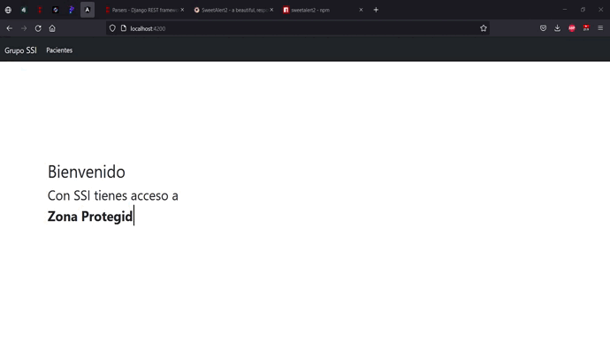

# Prueba Tecnica Grupo SSI
### Realizado por: Julian Andres Gomez Gomez 

## Installation
<div align="center">

</div>

```sh
git clone  <url-repo>
cd frontend
npm i
ng serve
```

Then move to backend
```sh
cd ../backend
python3 -m venv env
source env/bin/activate
pip3 install -r requirements.txt
python3 ./manage.py runserver
```
